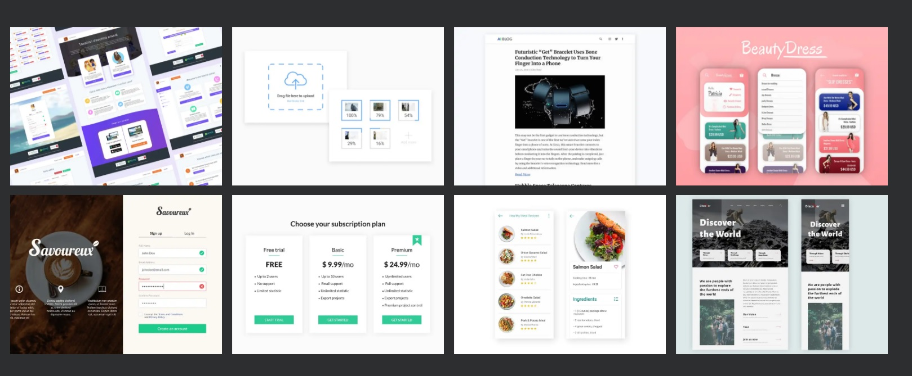

import { Link } from "gatsby";
import hoverGif from "./hover-gif.gif";

## Overview

- In this guide I will be going over how I created my UI-design showcase page which you can find <Link to="/ui-design">HERE</Link>.

- You can find the completed code at the bottom of this page or in [this CodePen](https://codepen.io/MoreeZ/pen/OJBWqBy)

## CSS Grid

CSS Grid is a pretty neat tool for creating layouts that are flexible and versatile, without having to deal with tricky positioning and floats. You can easily customize your grid with rows and columns to make it look just the way you want it. What's more, you can make your design responsive with CSS Grid by using media queries to adjust your layout for different screen sizes. This is great for making sure your website looks good on all devices, like desktops, tablets, and smartphones. So, if you're designing a restaurant website, you can create a menu layout that works well on any screen!

### HTML Setup

First, let's look at the HTML code. It contains a div with a class of page-content which contains multiple divs with a class of card-container. Each card-container div contains an img and five spans with a class of hover-line.

```html
<div class="page-content">
  <div class="page-content">
    <div class="card-container">
      <span class="hover-line"></span>
      <span class="hover-line"></span>
      <span class="hover-line"></span>
      <span class="hover-line"></span>
      
    </div>

    <div class="card-container">
      <span class="hover-line"></span>
      <span class="hover-line"></span>
      <span class="hover-line"></span>
      <span class="hover-line"></span>
      
    </div>
    ...
  </div>
</div>
```

### Grid Usage

We can make a great looking grid layout with just three simple lines of CSS.

```css
.page-content {
  display: grid;
  grid-template-columns: 1fr 1fr 1fr 1fr;
  gap: 14px;
}
```

1. `display: grid;` will enable the grid layout.
2. `grid-template-columns: 1fr 1fr 1fr 1fr;` will specify the amount of columns in your grid. In our example we will create four columns.
3. `gap: 14px;` will add a gap between each element in your grid

With just this code we created a grid that looks like this..



### Responsiveness

Making this grid responsive is just as easy!

```css
@media only screen and (max-width: 1200px) {
  .page-content {
    grid-template-columns: 1fr 1fr 1fr;
  }
}
@media only screen and (max-width: 900px) {
  .page-content {
    grid-template-columns: 1fr 1fr;
  }
}
@media only screen and (max-width: 700px) {
  .page-content {
    grid-template-columns: 1fr;
  }
}
```

All we have to do is add breakpoints and decrease the amount of columns at teach breakpoint.

## Hover animation

This unique hover effect is achieved by using transform, `:before` pseudo-elements, and keyframe animations to make the hover-line spans grow and rotate in different directions.

### Effect

Creating this hover effect consists of two parts [Part 1: Border Animation](#part-1-border-animation) and [Part 2: Zoom Effect](#part-2-zoom-effect)


### Part 1: Border Animation

The animation was inspired by _Swarup Kumar Kuila's_ [border-animation-css](https://codepen.io/uiswarup/pen/RBByzW) on [CodePen](https://codepen.io/).

It is created by adding four spans before our image. Each span will have a set width and height and it will expan whenever the container is hovered.

```css

.hover-line {
  position: absolute;
  width: 100%;
  height: 100%;
  top: 0;
  left: 0;
  display: block;
  box-sizing: border-box;
}

.hover-line:nth-child(1),
.hover-line:nth-child(4) {
  transform: rotate(180deg);
}
.card-container:hover .hover-line:nth-child(even):before {
  content: "";
  position: absolute;
  width: 3px;
  height: 100%;
  background: #e555d6;
  animation: hoverLinesY 300ms ease-out;
}
.card-container:hover .hover-line:nth-child(odd):before {
  content: "";
  position: absolute;
  background-color: pink;
  width: 100%;
  height: 3px;
  background: #e555d6;
  animation: hoverLinesX 300ms ease-out;
}

@keyframes hoverLinesX {
  0% {
    transform: scaleX(0);
    transform-origin: left;
  }
  100% {
    transform: scaleX(1);
    transform-origin: left;
  }
}
@keyframes hoverLinesY {
  0% {
    transform: scaleY(0);
    transform-origin: bottom;
  }
  100% {
    transform: scaleY(1);
    transform-origin: bottom;
  }
}
```

### Part 2: Zoom Effect

The zoom effect is quite basic. All we have to do is increse the scale of the div with `card-container` class after a set delay.

This can be achieved with something like this:

```css
.card-container {
  overflow: hidden;
  cursor: pointer;
  position: relative;
  transition: transform 150ms linear, box-shadow 150ms linear;
  transition-delay: 0ms;
  box-shadow: 0px 0px 10px #0009;
}

.card-container:hover {
  z-index: 1;
  transform: scale(1.12);
  transition-delay: 300ms;
}
```

## Full code

You can find the full code to make this effect [on my CodePen](https://codepen.io/MoreeZ/pen/OJBWqBy)

### HTML

```html
<div class="page-content">
  <div class="card-container">
    <span class="hover-line"></span>
    <span class="hover-line"></span>
    <span class="hover-line"></span>
    <span class="hover-line"></span>
    
  </div>

  <div class="card-container">
    <span class="hover-line"></span>
    <span class="hover-line"></span>
    <span class="hover-line"></span>
    <span class="hover-line"></span>
    
  </div>
  ...
</div>
```

### CSS

```css
.page-content {
  display: grid;
  grid-template-columns: 1fr 1fr 1fr 1fr;
  gap: 14px;
}
@media only screen and (max-width: 1200px) {
  .page-content {
    grid-template-columns: 1fr 1fr 1fr;
  }
}
@media only screen and (max-width: 900px) {
  .page-content {
    grid-template-columns: 1fr 1fr;
  }
}
@media only screen and (max-width: 700px) {
  .page-content {
    grid-template-columns: 1fr;
  }
}
```

```css
.card-container,
img {
  width: 100%;
  height: 300px;
  object-fit: cover;
}
.card-container {
  overflow: hidden;
  cursor: pointer;
  position: relative;
  transition: transform 150ms linear, box-shadow 150ms linear;
  transition-delay: 0ms;
  box-shadow: 0px 0px 10px #0009;
}

.card-container:hover {
  z-index: 1;
  transform: scale(1.12);
  transition-delay: 300ms;
}

.hover-line {
  position: absolute;
  width: 100%;
  height: 100%;
  top: 0;
  left: 0;
  display: block;
  box-sizing: border-box;
}

.hover-line:nth-child(1),
.hover-line:nth-child(4) {
  transform: rotate(180deg);
}
.card-container:hover .hover-line:nth-child(even):before {
  content: "";
  position: absolute;
  width: 3px;
  height: 100%;
  background: #e555d6;
  animation: hoverLinesY 300ms ease-out;
}
.card-container:hover .hover-line:nth-child(odd):before {
  content: "";
  position: absolute;
  background-color: pink;
  width: 100%;
  height: 3px;
  background: #e555d6;
  animation: hoverLinesX 300ms ease-out;
}

@keyframes hoverLinesX {
  0% {
    transform: scaleX(0);
    transform-origin: left;
  }
  100% {
    transform: scaleX(1);
    transform-origin: left;
  }
}
@keyframes hoverLinesY {
  0% {
    transform: scaleY(0);
    transform-origin: bottom;
  }
  100% {
    transform: scaleY(1);
    transform-origin: bottom;
  }
}
```

## Conclusion

CSS Grid is a versatile and responsive tool for creating flexible layouts without the need for complex positioning and floats, making it ideal for designing websites that look great on any device.

This border hover effect looks badass.