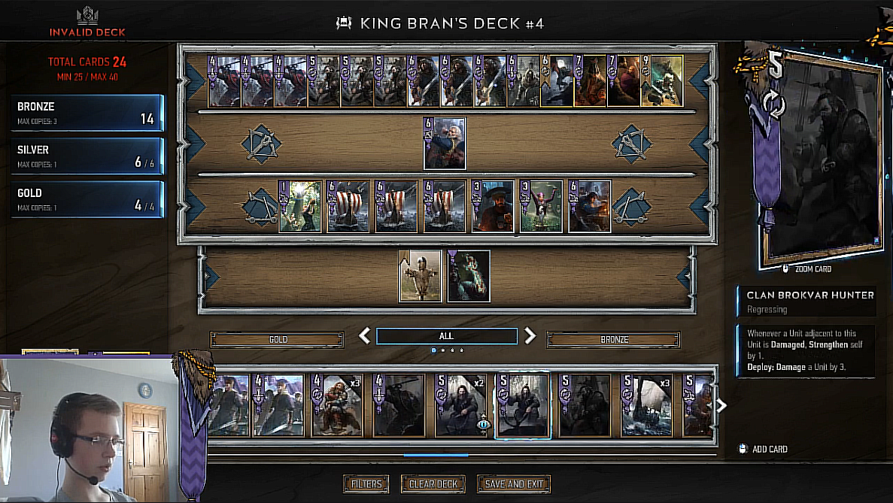
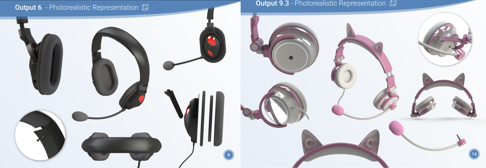
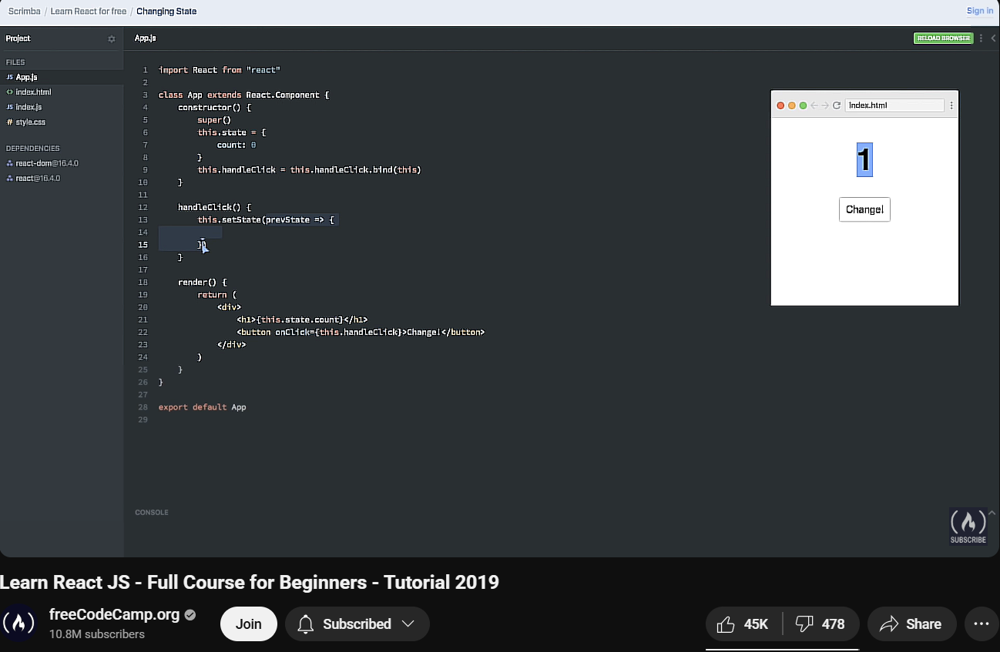
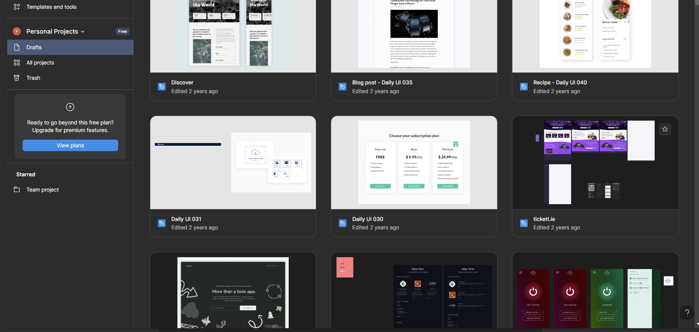

## Early Interests

Growing up, I watched people online with high-end PC setups playing resource intensive games at 60FPS and feel a little envious, given that I only had an old Acer laptop. I have always been quite creative and in 2014, I wanted to make YouTube videos and stream on Twitch, but trying to record gameplay would either overheat my laptop or crash most games.

I didn't know anyone who was good with computers and couldn't afford to buy new hardware, so whenever something broke, I had to figure out myself how to fix it. I actually enjoyed the challenge and when my parents noticed that, they began relying on me for tech-related tasks. Then my relatives, then the neighbours and before long, I became the go-to local tech support kid.

At the same time, I had a love for art. I started drawing and painting at a very young age. I was one of the top art students in primary school, and those early skills in visual thinking shaped a lot of my interests.

Eventually, I drifted away from art. It was clear that it wouldn't pay the bills, and I had a friend who was a much better artist anyway. But when it came to problem-solving, I felt like I had a real edge. So I decided to double down on that.

## School Years

When I was in school, I found most subjects boring. The only ones that held my attention were Mathematics and Design and Communication Graphics (DCG). Maths offered glimpses of the kind of problem-solving I enjoyed, but DCG was where I really thrived. It combined logic, visual thinking, and computers — three things that came naturally to me.

I had a strong ability to understand shapes and spatial relationships, which helped me excel in DCG. The subject also involved using CAD software, something I quickly became comfortable with thanks to the countless hours I had already spent in front of a computer. For our final project, we had to design a product in SolidWorks. I created a custom headset design, which ended up being ranked first in the class.

Given my interest in problem-solving, my preference for working with things over people, and my introverted nature, it felt natural to pursue something like engineering or computer science in college.

Initially, I planned to study computer science in Galway — it was closer to home, and I knew I couldn't afford to live alone in a big city like Dublin. But a conversation with my career guidance counsellor changed everything. She explained the government funding options available for students and encouraged me to apply to the best university I could.

Thanks to her advice (and some careful budgeting), I put Computer Science at Trinity College Dublin as my first choice on the CAO application. I'm still grateful to her for pointing me in that direction.
(Interestingly, my second choice was Psychology — but that's a story for another day.)

## Learning Programming

My dad used to tell me, "If you're going to spend all that time on the computer, at least use some of it to learn how it works instead of just playing games."

At the time, I was critical of him (like most teenagers probably would be) but deep down, I knew he was right. I could still play games, but if I committed just an hour a day to learning something useful, I knew I'd be seriously skilled at it within a couple of years.

That thought hit me hard. I looked back at the last two years of my life and felt nothing but regret. I hadn't done anything meaningful — not even in school. I kept wondering: What if I had spent just a little time each day learning to code? Where would I be now?

I didn't want to feel that kind of regret again. I knew I was still young, and if I didn't start taking myself seriously, I might waste the next two years too — and possibly the rest of my life.

The problem was, I didn't know anyone who could code. I had no mentors, no roadmap, and no idea where to start. So I did what most people do when they're lost: I went to YouTube. I watched video after video explaining different areas of programming, different languages, and different paths. I was trying to make sense of it all.

Being a visual thinker, I knew I needed to see my work come alive on a screen. That's what drew me to web development. I discovered [freecodecamp.org](https://www.freecodecamp.org), which offered hands-on lessons in HTML, CSS, and JavaScript. I paired that with YouTube tutorials, which I found easier to follow than reading documentation.

My learning process became a cycle: I'd do a few freeCodeCamp lessons to understand the fundamentals, then jump to YouTube to follow along with someone building a real project. I was constantly switching between theory and practice.

One of my earliest projects was a simple JavaScript calculator. I hit a bug that took four hours to fix. When it finally worked, I felt a rush that no video game had ever given me. That single moment gave me more motivation than any course ever could. It showed me what I was capable of. (I find it sad that many learners these days will miss out on moments like that since they can put whatever peoblem they have into a generative AI model and get an anwser.) But the hardest part wasn't starting. It was sticking with it.

To stay consistent, I made a rule for myself: I wouldn't go to bed until I worked for at least 30 minutes learning something. Even if it was midnight and I had school early the next morning, I'd muster some barin power to do some programming.

That habit of getting something done every day, even for a short time, shaped the discipline I would carry into college and eventually my career.

## Learning Design

My software projects worked, but they looked terrible, and that really frustrated me. I've always cared about aesthetics, and when something didn't look the way I imagined, it distracted me more than broken functionality ever could. That frustration became motivation. I've learned that strong emotions, when channeled properly, can be a powerful driver for improvement.

Because I didn't know anyone else with the same interests, I felt I had to become well-rounded. If I wanted to create a strong personal project — something I could be proud of — I needed to get good at everything involved in building a product. Design was clearly one of those skills.

What really pushed me to improve was an online challenge called the Daily UI Challenge. Each day, I'd get a prompt to design a specific interface — like a login screen or a checkout page — and I used Figma to create every design. I set programming aside for a while and focused entirely on building a strong foundation in UI and UX.

I studied design principles through YouTube tutorials and shared my work online for feedback. Within a few months, I started noticing design flaws everywhere — in apps, on websites, even in everyday life. I'd sometimes redesign websites just for fun, testing whether I could improve on them. In many cases, I could.

Once you learn to recognize good design, bad design stands out in every detail. It's like flipping a switch you can't turn off. That instinct to fix what doesn't feel right is one reason people started calling me a perfectionist.

To put everything together, I began creating solo projects. One of my favorites was a fake online computer store called comp.com. I designed the entire UI in Figma, then built it using React.js (before functional components were a thing) and pure CSS — no frameworks.

When I told people I built everything without a CSS library, many were surprised. But I had a clear reason — I wanted full control over the design. Using pre-made components felt limiting, and I cared about making things look exactly the way I envisioned. Learning the fundamentals gave me a much deeper understanding of styling on the web. It allowed me to build interfaces that didn't just work but also felt unique and creative. That decision to go deep, rather than rely on shortcuts, gave me a real advantage both in college and later in professional settings.

That early focus on visual quality has paid off. When I work on front-end projects, I can quickly identify and fix UI issues, and I'm able to create interfaces that are unique, well-crafted, and beyond what generative AI tools can replicate.

## Opportunities Start Rolling In

"Luck is when preparation meets opportunity" - Seneca

As my skills developed, real opportunities started to appear. I began receiving requests to build websites for startups, local businesses, and student societies.

One of my first projects was for [Luna Technology Society](https://lunatech.pl), a student rocketry group started by a childhood friend. It gave me the chance to support a cause I believed in while putting my abilities to the test.

Even while on holiday, with very little money, I found a way to make things work. I negotiated a deal with a hotel owner: I would build [a website](https://lavista-demo.web.app) for him in exchange for a discounted stay. He got a great deal, and I added another project to my growing portfolio.

As I built more, I started attracting attention from self-proclaimed entrepreneurs with big ideas but no clear plans. Many asked me to create entire products or technical infrastructure for free, promising future rewards that never came. I learned quickly to be cautious about where I invested my time.

During a trip to the Amazon rainforest, I helped a [small family business](https://https://riverpeopleecuador.com) improve their website, boost their search rankings, and strengthen their online presence. It was one of the first times I saw how my skills could make a real impact in the world.

Soon after, I landed a part-time job as a [programming tutor](https://www.olus.education). I taught Java and web development fundamentals to students, which helped me deepen my understanding and earn a steady income while studying computer science. That job also made it possible for me to fund a university exchange program in Japan.

Later, a university research lab approached me to develop an [Irish language learning app](https://www.researchgate.net/publication/391149095) for children. The work was meaningful, well paid, and genuinely enjoyable. After spending years building websites for free just because I loved it, getting paid to do what I cared about felt incredibly rewarding. That project eventually became the focus of my Master's dissertation.

With all of this experience behind me, I was able to secure internships at Bloomberg and Amazon. These roles gave me the chance to apply everything I had learned on a much larger scale and helped me grow significantly as a developer and professional.

## Looking Ahead

I've just finished my Master's in Computer Science with Distinction. It's been a journey shaped by curiosity, creativity, and a lot of persistence.

Now I'm stepping into my career as a software engineer, and I wouldn't change a thing about how I got here. I hope this little story inspires someone out there to keep going too.
